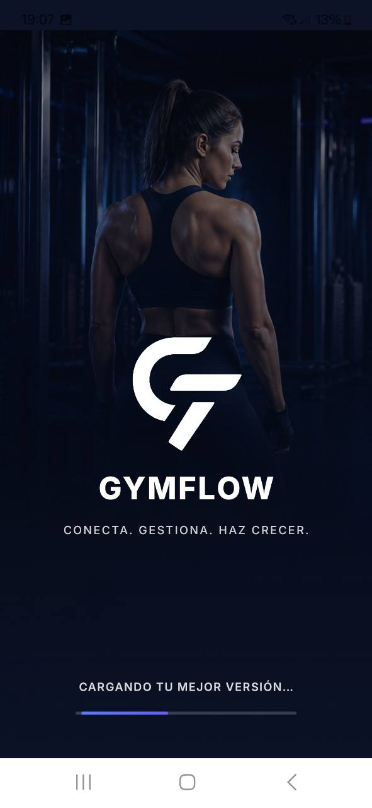
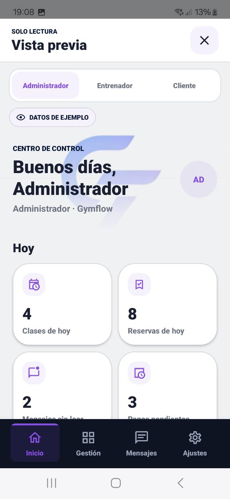
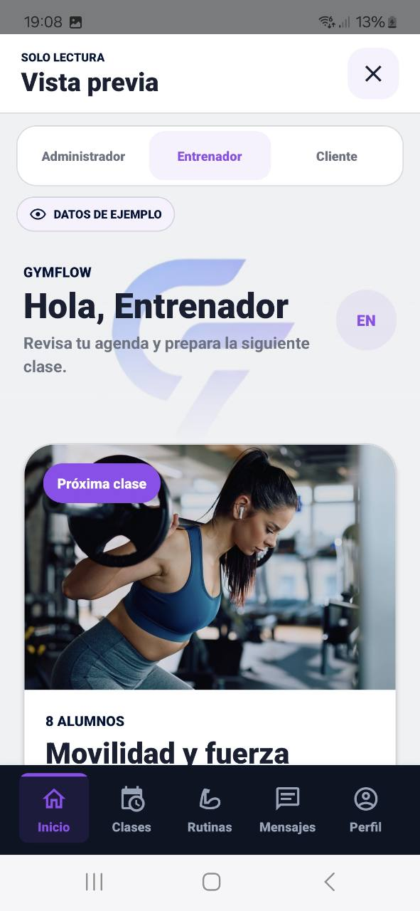
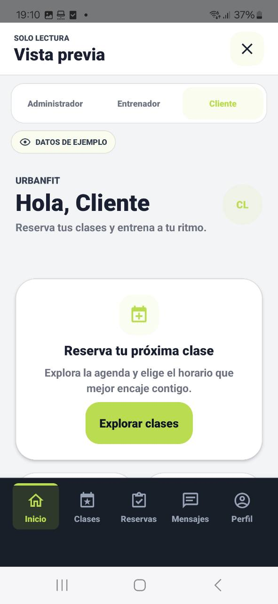
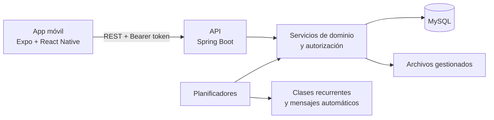

<p align="center">
  
</p>

<p align="center">
  Plataforma full stack para gestionar centros deportivos, coordinar al equipo y ofrecer una experiencia móvil cuidada a sus clientes.
</p>

## Sobre el desarrollo

GymFlow fue desarrollado como un proyecto de aprendizaje y experimentación utilizando de forma intensiva herramientas de IA generativa durante el proceso de implementación.

La definición del producto, sus funcionalidades, requisitos y decisiones de diseño se realizaron de forma iterativa, utilizando IA como herramienta de apoyo para generar, modificar y revisar parte del código.

Por este motivo, el repositorio representa también una experiencia práctica de desarrollo asistido por IA y no pretende atribuir la autoría manual de la totalidad del código.

<p align="center">
  
  
  
  
  
</p>

## El producto

GymFlow centraliza la operativa diaria de un gimnasio: programación de clases, reservas, rutinas, pagos, comunicación, altas de usuarios y personalización del centro.

La aplicación adapta navegación, información y acciones a **administradores**, **entrenadores** y **clientes**. Detrás de la interfaz, la API conserva la autoridad sobre la identidad, los permisos y el aislamiento de datos de cada gimnasio.

El resultado es una primera versión funcional que combina diseño de producto móvil, modelado de dominio, persistencia, seguridad y pruebas automatizadas.

> Estado: primera versión funcional completada y en pausa planificada. Es un proyecto de porfolio, no un servicio desplegado en producción.

## Experiencia móvil

<p align="center">
  
  &nbsp;&nbsp;
  
</p>

<p align="center">
  <em>Identidad de producto, acceso por credenciales y entrada mediante invitación del gimnasio.</em>
</p>

<p align="center">
  
  
  
</p>

<p align="center">
  <em>Tres experiencias coherentes, con navegación y prioridades propias para cada rol.</em>
</p>

Las capturas utilizan datos de ejemplo y muestran únicamente la entrada y el punto de partida del producto. El resto de flujos se resume a continuación sin convertir el README en un recorrido completo por la aplicación.

## Funcionalidades destacadas

- Programación semanal de clases y materialización de sesiones con identificadores estables.
- Reservas con control de capacidad y protección ante solicitudes concurrentes por la última plaza.
- Rutinas, asignaciones, ejercicios multimedia y calculadora de repetición máxima (1RM).
- Pagos persistentes con estados pendiente, pagado, cancelado y vencido calculado.
- Mensajes, comunicados y automatizaciones dirigidas por audiencia.
- Alta manual de clientes y entrenadores, además de invitaciones de clientes mediante enlace o QR.
- Fotografías desde cámara o galería y sistema de archivos con validación de tipo y firma binaria.
- Identidad visual configurable y previsualizaciones neutrales de los tres roles.

## Arquitectura



La identidad del usuario y su gimnasio se obtienen siempre de la sesión. Los servicios vuelven a validar rol, pertenencia y estado antes de consultar o modificar información.

Más información en [Arquitectura](docs/architecture.md), [API](docs/api.md) y [Decisiones técnicas](docs/technical-decisions.md).

## Tecnologías

| Área | Tecnologías |
| --- | --- |
| Aplicación | React Native, Expo Router, TypeScript |
| Backend | Java 17, Spring Boot, Spring MVC, Spring Data JPA |
| Datos | MySQL, H2 para pruebas |
| Seguridad | BCrypt, tokens HMAC, autorización por rol y gimnasio |
| Calidad | JUnit, Mockito, Node Test Runner, ESLint, TypeScript |

## Calidad y seguridad

- Suite backend con **158 pruebas automatizadas** tras la preparación pública.
- Pruebas específicas de autorización, aislamiento entre gimnasios, concurrencia y tareas programadas.
- Pruebas unitarias de calendario y cálculo 1RM en la aplicación.
- Contraseñas almacenadas únicamente como hash BCrypt.
- Secretos y direcciones del entorno fuera del código fuente.
- Subidas temporales, asociación controlada y limpieza automática de archivos abandonados.
- Validación continua mediante GitHub Actions.

## Ejecución local

### Requisitos

- Node.js 22 y npm.
- JDK 17.
- MySQL 8 o superior.

### Backend

Consulta [backend/README.md](backend/README.md) para crear la base de datos y configurar las variables necesarias.

```bash
cd backend
./mvnw spring-boot:run
```

### Aplicación

Consulta [mobile/README.md](mobile/README.md) para configurar la URL de la API.

```bash
cd mobile
npm ci
npm start
```

## Estructura

```text
gymflow/
├── mobile/       # Aplicación Expo / React Native
├── backend/      # API REST Spring Boot
├── docs/         # Arquitectura, API y decisiones técnicas
└── .github/      # Validación continua
```

## Próximos pasos

- Preparar datos de demostración reproducibles.
- Incorporar migraciones versionadas de base de datos.
- Sustituir el almacenamiento local de archivos por un servicio de objetos.
- Añadir observabilidad y límites de peticiones para un despliegue real.

## Autora

Desarrollado por **Julia Cuevas**.

El código se publica con fines de evaluación profesional. Consulta [LICENSE](LICENSE) antes de reutilizarlo.
