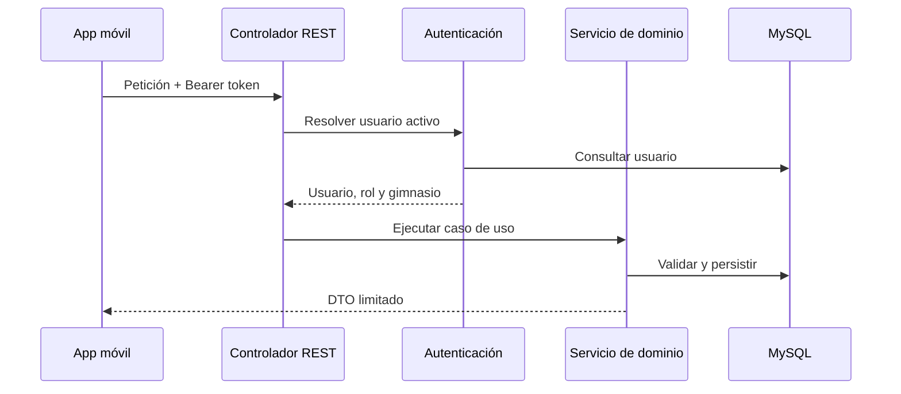

# Arquitectura

## Visión general

GymFlow separa la interfaz móvil, la API y la persistencia. La aplicación no decide permisos ni confía en identificadores de usuario enviados por el cliente: el backend deriva la identidad y el gimnasio del token de sesión y vuelve a validar cada operación.

## Aplicación móvil

- **Expo Router** gestiona las rutas de acceso, invitación y aplicación autenticada.
- Una sesión central conserva el token en almacenamiento seguro y coordina la expiración ante respuestas `401`.
- Los paneles comparten un sistema de diseño, pero su navegación y acciones dependen del rol.
- Las operaciones sensibles bloquean pulsaciones duplicadas mediante referencias síncronas.
- Los errores de red conservan los últimos datos válidos y ofrecen reintento; no se presentan como listas vacías.

## Backend

La API sigue una separación por capas:

1. Los controladores reciben y validan la forma de la petición.
2. Los servicios resuelven autorización, reglas del dominio y transacciones.
3. Los repositorios encapsulan el acceso mediante Spring Data JPA.
4. Los DTO limitan los datos expuestos a cada cliente.

## Autenticación y permisos

- Los tokens de sesión se firman con HMAC-SHA256 y tienen caducidad.
- El secreto de firma es obligatorio y debe contener al menos 32 caracteres.
- Las contraseñas utilizan BCrypt.
- Las invitaciones usan un secreto y un propósito independientes de la sesión.
- Los roles disponibles son `ADMIN`, `ENTRENADOR` y `CLIENTE`.
- El aislamiento por gimnasio se comprueba en el backend, incluso cuando el cliente conoce un ID externo.

## Clases y reservas

Una programación contiene reglas exactas de día y hora. Un materializador idempotente genera sesiones futuras con ID estable para que cada reserva apunte a una sesión concreta. Una restricción única y el bloqueo pesimista evitan duplicados y protegen la última plaza disponible.

## Mensajes automáticos

Los comunicados pueden ser inmediatos o programados. Los destinatarios se materializan para mantener una audiencia estable y las tareas concurrentes se protegen para evitar ejecuciones duplicadas.

## Archivos

Los archivos se escriben primero como temporales. El backend contrasta el MIME declarado con la firma binaria, valida tamaño, finalidad, usuario y gimnasio, y solo después permite asociarlos a una entidad. Una tarea elimina temporales abandonados sin tocar archivos asociados o contenido heredado.
